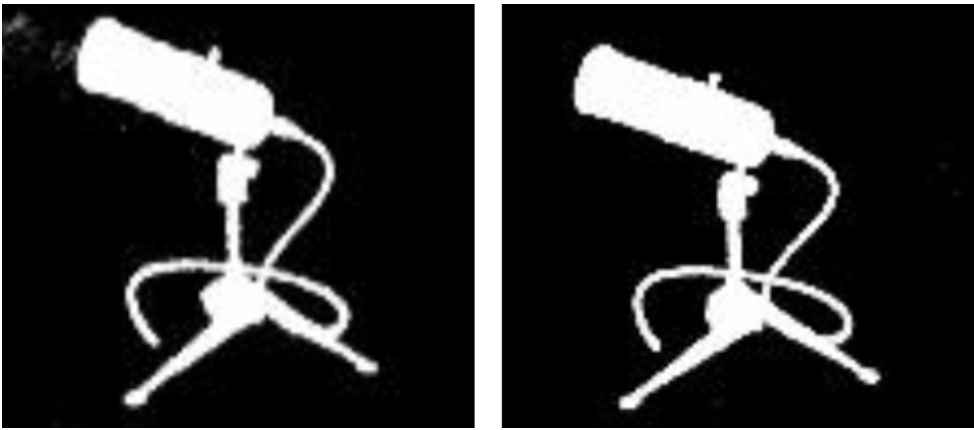
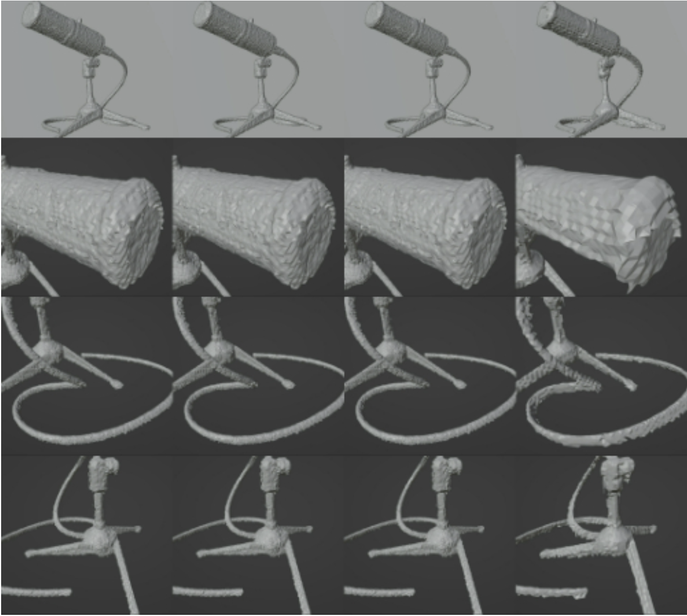
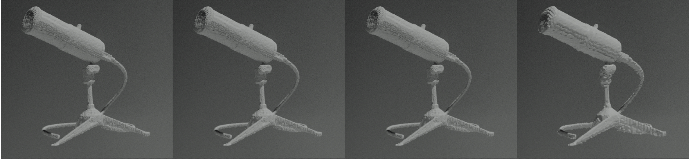
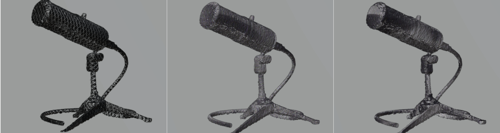

# Adapting Neural Radiance Fields for Shape-from-Silhouette Reconstruction

> **Binary NeRF for 3D geometry reconstruction from silhouette images — end-to-end pipeline from image segmentation to textured mesh**
>
> *TU Berlin · Computer Vision Project · Nerfstudio-based implementation*

---

## Overview

Standard NeRF struggles with textureless or highly reflective objects: photometric loss requires consistent RGB colour across views, which fails for metal grilles, cables, and specular surfaces. This project reformulates NeRF for the **Shape-from-Silhouette** task — replacing RGB supervision entirely with binary occupancy prediction.

The result is a complete pipeline that takes multi-view photographs of an object, segments them into binary masks, estimates camera poses, trains a modified NeRF on binary data, and exports a clean textured mesh.

**Dataset**: A studio microphone — chosen for its combination of moderately complex geometry (metal grille, knobs, cable), multi-material surfaces (metal, plastic, rubber), and its concrete applicability to VR/AR and acoustic simulation.

---

## Motivation: Why Binary NeRF?

The standard RGB NeRF approach failed on our dataset. The microphone cable produced noticeable breakage in renders, and the reflective metal body introduced view-dependent colour inconsistencies that the photometric loss could not resolve.

| | RGB NeRF (baseline) | Binary NeRF (ours) |
|---|---|---|
| Input | RGB images | Binary silhouette masks |
| Loss target | Pixel colour | Foreground/background label |
| Output head | 3-channel RGB | 1-channel sigmoid ∈ (0,1) |
| Background blending | Required | Eliminated (black = no-op) |
| Failure mode | Colour inconsistency, broken geometry | — |

Binary preprocessing decoupled shape reconstruction from appearance, allowing NeRF to focus entirely on learning geometry.

---

## Pipeline

```
┌──────────────────────────────────────────────────────────────────────────────┐
│                                                                              │
│  Multi-view          Image              COLMAP             Binary NeRF       │
│  Photos              Segmentation       (Masked SfM)       Training          │
│                                                                              │
│  📷 📷 📷   ──►   ⬛⬜ ⬛⬜   ──►   [R|t] × N    ──►  Nerfacto +        │
│  70 images          Binary masks         Camera poses        sigmoid head     │
│                     (GrabCut)            from masked          binary volume   │
│                                          feature match        rendering       │
│                          │                                        │           │
│                          └────────────────────────────────────────┘           │
│                                          ▼                                    │
│                               TSDF Mesh Extraction                            │
│                               (Marching Cubes on                              │
│                                voxel density field)                           │
│                                          │                                    │
│                                          ▼                                    │
│                               Mesh Optimisation + Blender                     │
│                               Texture Rendering                               │
│                                                                              │
└──────────────────────────────────────────────────────────────────────────────┘
```

---

## Technical Contributions

### 1 · Image Segmentation — Generating Binary Masks

Three segmentation methods were implemented and systematically compared to convert RGB photographs into foreground/background masks:

| Method | Approach | Pros | Cons | Verdict |
|---|---|---|---|---|
| **U-Net** | Deep learning encoder-decoder | Highest accuracy, fine boundary detail | Requires labelled training data; heavy compute | Good but impractical |
| **Otsu's Thresholding** | Histogram global threshold, minimises intra-class variance | Fast, zero parameters | Fails when foreground/background contrast is low | Incomplete masks |
| **GrabCut** ✅ | Iterative GMM + graph cuts from bounding box | Accurate, robust to complex backgrounds, minimal manual input | Sensitive to bounding box initialisation | **Selected** |

**GrabCut workflow:**
1. Draw a bounding box around the object → initialise foreground/background Gaussian Mixture Models (GMMs)
2. Iteratively refine GMMs and apply graph cuts until convergence
3. Output: binary mask, foreground pixels = 1, background = 0

Segmentation code: [Image-Segmentation repository](https://github.com/Project-1-Neural-Shape-From-Silhouette/Image-Segmentation)

---

### 2 · Camera Pose Estimation via Masked COLMAP

Instead of running COLMAP on raw RGB photographs — which extracts background features that degrade pose accuracy — **COLMAP was applied to GrabCut-masked images**, restricting Structure-from-Motion feature matching exclusively to object pixels.

```
Raw RGB image  ──►  GrabCut mask  ──►  Masked image  ──►  COLMAP SfM  ──►  [R|t] per frame
     📷                ⬛⬜                📷🎭            Feature            Camera poses
                                                            matching on        for NeRF
                                                            object only        training
```

This reduced background noise in feature matching, produced more reliable camera pose estimates, and improved the quality of downstream 3D reconstruction.

---

### 3 · Binary Neural Radiance Field

The **Nerfacto** model was selected as the backbone — a hierarchical multi-resolution grid + 8-layer MLP with ReLU activations — and modified throughout for binary operation.

#### Network Architecture Change

```
Original Nerfacto:                      Modified (ours):
  MLP → [σ density,  RGB colour]  →      MLP → [binary occupancy  p ∈ (0,1)]
  Final activation: none / softplus       Final activation: sigmoid
  Output: 3 + 1 channels                  Output: 1 channel
```

The sigmoid output represents the probability that a sampled 3D point lies within the object silhouette. No additional 0.5 thresholding is applied — hard thresholding was tested but caused training failure due to zero gradients through the step function, compounded by loss function mismatch and learning rate instability.

#### Volume Rendering Change

```
Standard NeRF ray integral:              Binary NeRF ray integral:
  C(r) = Σ Tᵢ αᵢ cᵢ              →       S(r) = Σ Tᵢ αᵢ pᵢ
  (accumulate RGB colour cᵢ)              (accumulate binary occupancy pᵢ)
  + background RGB blending               background blending removed
```

Where `Tᵢ = exp(−Σⱼ<ᵢ σⱼ δⱼ)` is transmittance and `αᵢ = 1 − exp(−σᵢ δᵢ)`. Background blending was eliminated entirely — in binary images the background is black (0), so the blending term has no effect and is an unnecessary computation.

#### Training Progression

Without modification, Nerfacto trained on binary data produced grey-scale outputs — the RGB output head blended continuously with the background, preventing sharp foreground/background separation. After architectural and rendering modifications, the network converged to clean binary silhouettes that accurately reflected the microphone's geometry.

| Before modification (RGB head on binary input) | After modification (Binary NeRF) |
|---|---|
|  |  |
| Grey-scale, blended with background | Sharp binary silhouette |
---

### 4 · Loss Function Evaluation

Six loss functions were implemented and evaluated for binary silhouette supervision, monitored across 30,000 training epochs by training loss and validation PSNR:

| Loss Function | Formula | Training Loss | Val. PSNR | Verdict |
|---|---|---|---|---|
| **MSE** | `(1/N) Σ (yᵢ − ŷᵢ)²` | Stable, low | **Highest** ✅ | Best overall |
| **Smooth L1 (Huber)** | L2 when diff < β, L1 otherwise | Stable, low | High ✅ | Strong runner-up |
| **L1** | `(1/N) Σ abs(yᵢ − ŷᵢ)` | Stable, low | Good | Robust, less sensitive |
| **Charbonnier** | `√(diff² + ε²)` | Stable, low | High | Good outlier handling |
| **Dice** | `1 − (2Σpᵢtᵢ + s)/(Σpᵢ² + Σtᵢ² + s)` | Stuck ~0.5 | Low ✗ | Not suitable |
| **Custom BCE** | `−Σ [y log p + (1−y) log(1−p)]` | High, unstable | Low ✗ | Convergence issues |

**Finding**: MSE and Smooth L1 were most effective. Dice Loss stagnated at 0.5 — its design for overlap-based segmentation metrics does not translate well to pixel-wise reconstruction fidelity. Custom BCE showed high initial loss and convergence difficulties, likely due to sensitivity of logit-based probabilistic outputs without careful tuning.

---

### 5 · Mesh Export Parameter Optimisation

Meshes are extracted from the trained NeRF via **TSDF (Truncated Signed Distance Function) fusion** followed by the **Marching Cubes** algorithm on the learned volumetric density field. Three parameter configurations were compared against Nerfstudio defaults:

| Parameter | Description | Para1 | Para2 | Para3 ✅ | Default |
|---|---|---|---|---|---|
| **TSDF resolution [x,y,z]** | Higher = more detail, more compute | [256,256,256] | [256,256,256] | [256,256,256] | [128,128,128] |
| **px_per_uv_triangle** | Texture resolution per mesh triangle | 8 | 8 | **10** | 4 |
| **num_pixels_per_side** | Rendered image resolution | 2048 | 3000 | 2048 | 2048 |


*From left to right: Para1 · Para2 · Para3 (best) · Default*

**Para3 produced the highest visual quality** — finest texture detail, best lighting representation, and clearest surface articulation. Default parameters showed noticeable deficiencies in texture and light-shadow representation.

---

### 6 · Mesh Optimisation and Blender Visualisation

The raw TSDF mesh exhibited surface roughness from voxelisation artefacts. Two post-processing stages were applied:

1. **Mesh optimisation** — topology cleanup, subdivision and smoothing to recover fine geometric features: cable geometry and shadow detail, metal grille vs. bracket distinction, and overall body surface articulation
2. **Blender re-rendering and texturing** — three physically-based material sets were applied and compared, demonstrating applicability for creative design and animation production pipelines

The reconstructed microphone mesh successfully preserved overall body shape, cable geometry, metal grille detail, and bracket structure — though the rear half of the barrel showed less surface distinction, identified as an area for future improvement.


*Mesh re-rendered in Blender — surface roughness resolved*


*Three texture/material variations applied in Blender*
---

## Results Summary

| Stage | Outcome |
|---|---|
| Segmentation | GrabCut selected; accurate binary masks with minimal manual input |
| Camera poses | COLMAP on masked inputs produced reliable [R\|t] for all frames |
| Binary NeRF training | Converged to sharp binary silhouettes; grey-scale artefacts from unmodified RGB head eliminated |
| Loss function | MSE and Smooth L1 recommended for binary NeRF reconstruction tasks |
| Mesh quality | Para3 TSDF settings yielded highest detail and texture fidelity |
| Final render | Blender post-processing resolved surface roughness; multiple texture styles produced |

---

## Technical Stack

| Component | Technology |
|---|---|
| NeRF backbone | Nerfstudio — Nerfacto (modified) |
| Segmentation | Python · OpenCV · PyTorch (U-Net) |
| Camera pose estimation | COLMAP (Structure-from-Motion) |
| Mesh extraction | TSDF fusion · Marching Cubes |
| Post-processing & render | Blender |
| Language | Python 3 |

---

## Repository Structure

```
.
├── cameras/         # Camera model and pose utilities
├── configs/         # Training and export configuration files
└── README.md
```

Segmentation pipeline: [github.com/Project-1-Neural-Shape-From-Silhouette/Image-Segmentation](https://github.com/Project-1-Neural-Shape-From-Silhouette/Image-Segmentation)

---
